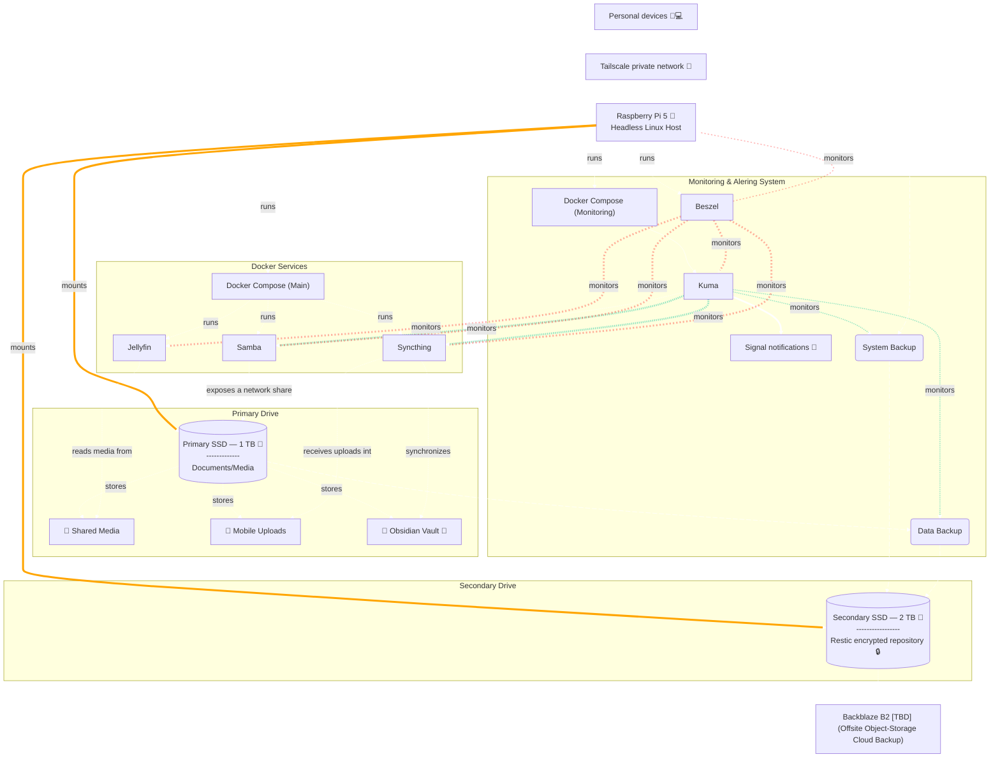

```mermaid

flowchart TB


    %% ========= DEFINE ITEMS ==========
    Pi["Raspberry Pi 5 🍓\nHeadless Linux Host"]
    Devices["Personal devices 📱💻"]
    Signal["Signal notifications 📱"]
    Syncthing["Syncthing"]
    Jellyfin["Jellyfin"]
    Samba["Samba"]
    DockerCompose["Docker Compose (Main)"]
    DockerComposeMonitor["Docker Compose (Monitoring)"]
    Tailnet["Tailscale private network 🛜"]
    BackBlaze["Backblaze B2 [TBD] (Offsite Object-Storage Cloud Backup)"]
    %%Uptime Kuma"]
    %%Restic["Restic encrypted repository 🔒"]

    %% ========= MAP ITEMS ============

    %% TOP LEVEL
    Devices <--> Tailnet
    Tailnet <--> Pi 
    Pi =="mounts"==> PrimarySSD
    Pi =="mounts"==> SecondarySSD 
    Pi -- runs --> DockerCompose
    Pi -- runs --> DockerComposeMonitor


    %% PRIMARY DRIVE 
    subgraph Primary Drive
        %%PrimarySSD@{shape: lin-cyl, label: "Primary SSD — 1 TB 💽\n-----------------------------\n- Obsidian Vault\n- MobileUploads\n- Documents/Media"}
        PrimarySSD[(Primary SSD — 1 TB 💽\n-------------\nDocuments/Media)]
        SharedMedia["📁 Shared Media"]
        MobileUploads["📁 Mobile Uploads"]
        ObsidianVault["📁 Obsidian Vault 📝"]
        
        PrimarySSD -.stores.-> ObsidianVault
        PrimarySSD -. stores .-> SharedMedia
        PrimarySSD -.stores.-> MobileUploads
    end


    subgraph Secondary Drive
        SecondarySSD[(Secondary SSD — 2 TB 💽\n-----------------\nRestic encrypted repository 🔒)]
    end

    %% DOCKER SERVICES   
    subgraph Docker Services
        Syncthing
        Jellyfin
        Samba
        DockerCompose -.runs.-> Jellyfin
        DockerCompose -.runs.-> Samba
        DockerCompose -.runs.-> Syncthing
        Syncthing -.synchronizes.-> ObsidianVault
        Jellyfin  -.reads media from.-> SharedMedia
        Syncthing -.receives uploads into.-> MobileUploads
        Samba -.exposes a network share.-> PrimarySSD
     end


    subgraph Monitoring & Alering System
        DockerComposeMonitor --> Kuma ==> Signal
        Kuma -.monitors.-> Jellyfin
        Kuma -.monitors.-> Syncthing
        Kuma -.monitors.-> Samba
        Kuma -.monitors.-> id1
        Kuma -.monitors.-> id2
        Beszel["Beszel"]
    end

    Pi -.runs.-> Beszel


    %% Backups flow %%
    Pi e4@--> id1(System Backup) e5@--> SecondarySSD
    e4@{ animation: fast}    
    e5@{ animation: fast}    

    PrimarySSD e3@--> id2(Data Backup) e6@-->  SecondarySSD
    e3@{ animation: fast}
    e6@{ animation: fast}    


    SecondarySSD -.-> BackBlaze

    %% Beszel
    Beszel -.monitors.-> Pi
    Beszel -.monitors.-> Jellyfin
    Beszel -.monitors.-> Syncthing
    Beszel -.monitors.-> Samba
    Beszel -.monitors.-> Kuma


    %%Kuma -.Monitoring.-> Syncthing
    %%Kuma -.Monitoring.-> Jellyfin
    %%%Kuma -.Monitoring.-> Samba

    %%Kuma -.-> DockerServices
    
    linkStyle default stroke:white
    linkStyle 2 stroke-width:4px,stroke:orange
    linkStyle 3 stroke-width:4px,stroke:orange
    linkStyle 22 stroke-width:2px,stroke:#90E4C1
    linkStyle 21 stroke-width:2px,stroke:#90E4C1
    linkStyle 20 stroke-width:4px,stroke:#90E4C1
    linkStyle 19 stroke-width:4px,stroke:#90E4C1
    linkStyle 29 stroke-width:2px,stroke:red,stroke-dasharray:3 4,opacity: 0.3
    linkStyle 30 stroke-width:4px,stroke:red,stroke-dasharray:3 4,opacity: 0.3
    linkStyle 31 stroke-width:4px,stroke:red,stroke-dasharray:3 4,opacity: 0.3
    linkStyle 32 stroke-width:4px,stroke:red,stroke-dasharray:3 4,opacity: 0.3
    linkStyle 33 stroke-width:4px,stroke:red,stroke-dasharray:3 4,opacity: 0.3


```
